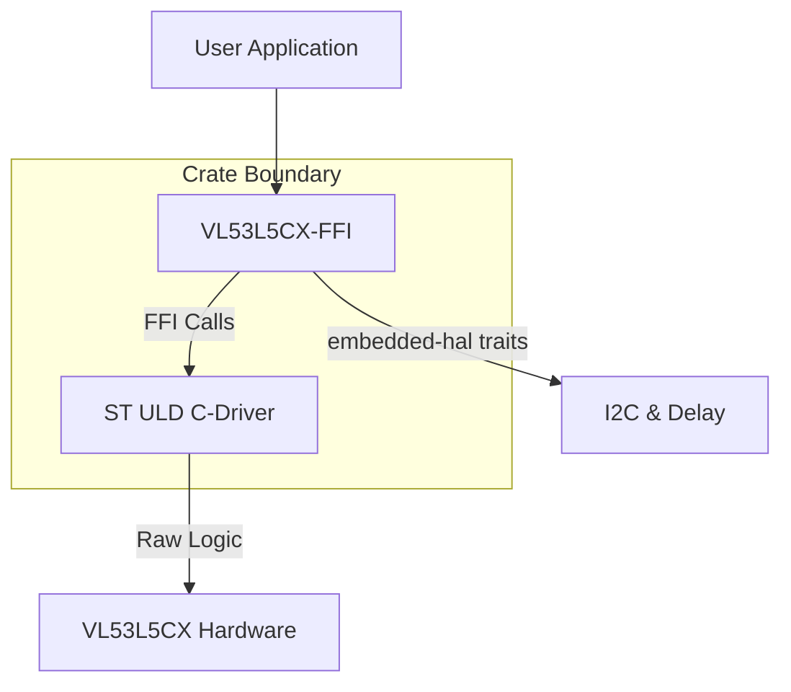

# VL53L5CX-FFI

[](https://crates.io/crates/vl53l5cx-ffi)
[](https://docs.rs/vl53l5cx-ffi)
[](LICENSE-MIT)
[](https://marketplace.visualstudio.com/items?itemName=bierner.markdown-mermaid)

A platform-agnostic Rust driver for the **STMicroelectronics VL53L5CX** Time-of-Flight (ToF) multi-zone ranging sensor.

This crate acts as a high-level wrapper around the official ST Ultra Lite Driver (ULD), utilizing `embedded-hal` traits to allow usage on any supported microcontroller (STM32, ESP32, nRF, RP2040, etc.) or Linux.

## Features

- **Platform Agnostic**: Built on `embedded-hal` (I2C) traits.
- **FFI Wrapper**: Statically links the official ST VL53L5CX ULD C-driver.
- **Multi-Zone Ranging**: Access to 4x4 or 8x8 zones functionality provided by the ULD.
- **Safe API**: Exposes a Rust-friendly API while handling the unsafe FFI calls internally.

## Installation

Add this to your `Cargo.toml`:

```toml
[dependencies]
vl53l5cx-ffi = "0.1.0"
```

## Usage

Note that while the crate name uses dashes (`-`), the library is imported using underscores (`_`) in your Rust code.

```rust
use vl53l5cx_ffi::{Vl53l5cx, bindings, platform::PlatformError};
use embedded_hal::{i2c::{I2c, SevenBitAddress}, delay::DelayNs};

fn main() -> Result<(), Box<dyn std::error::Error>> {
    // 1. Initialize your platform-specific I2C and Delay peripherals
    // This is just an example; you would use your specific HAL implementation.
    let i2c_dev: impl I2c<SevenBitAddress> = todo!(); 
    let delay_dev: impl DelayNs = todo!();
    
    // 2. Box the peripherals for type erasure
    let i2c_bus: Box<dyn I2c<SevenBitAddress, Error = PlatformError> + Send> = 
        Box::new(i2c_dev.map_err(PlatformError::from));
    let delay: Box<dyn DelayNs + Send> = Box::new(delay_dev);

    // 3. Initialize the sensor driver
    let mut sensor = Vl53l5cx::new(i2c_bus, delay, 0x29)?;
    
    // 4. Check communication and configure
    if sensor.is_alive()? {
        sensor.set_resolution(bindings::VL53L5CX_RESOLUTION_8X8)?;
        sensor.set_ranging_frequency_hz(15)?;
        
        sensor.start_ranging()?;
        
        loop {
            // Poll for data ready
            if sensor.check_data_ready()? {
                let results = sensor.get_ranging_data()?; // results is VL53L5CX_ResultsData
                // Process ranging data...
                // println!("Zone 0 Distance: {} mm", results.distance_mm[0]);
            }
        }
    }
    
    Ok(())
}
```

## Architecture & Design

This crate serves as a **Foreign Function Interface (FFI) wrapper** around the official STMicroelectronics Ultra Lite Driver (ULD).

Instead of rewriting the complex ranging algorithms from scratch, this crate embeds the vendor's C source code and exposes a safe, idiomatic Rust API.



### Key Concepts:

* **Platform Agnostic:** We implement the platform-specific C functions required by the ST ULD (`RdByte`, `WrByte`, `WaitMs`) by mapping them to the provided `embedded-hal` implementation in Rust.
* **Static Linking:** The crate utilizes a `build.rs` script to compile the original ST C-driver and link it statically to your final binary.

## Development Notes

### Viewing the Architecture Diagram
The architecture diagram in this README is created using Mermaid. To view it in Visual Studio Code's markdown preview, you will need to install the **Markdown Preview Mermaid Support** extension.


## ⚠️ License & Legal Disclaimer

### Rust Wrapper Code
The Rust source code in this crate is dual-licensed under either:

* **MIT License** ([LICENSE-MIT](LICENSE-MIT) or http://opensource.org/licenses/MIT)
* **Apache License, Version 2.0** ([LICENSE-APACHE](LICENSE-APACHE) or http://www.apache.org/licenses/LICENSE-2.0)

at your option.

### STMicroelectronics Driver Code
This crate statically links and redistributes the **STMicroelectronics VL53L5CX Ultra Lite Driver**, which is located in the source tree.

**The STMicroelectronics ULD software is subject to the proprietary STMicroelectronics license terms (SLA0044).**

> **Important:** Usage of the underlying C driver is strictly limited to use with **STMicroelectronics products** (specifically the VL53L5CX sensor). By using this crate, you agree to the terms of the STMicroelectronics software license found in the `LICENSE-ST` file included in this repository.