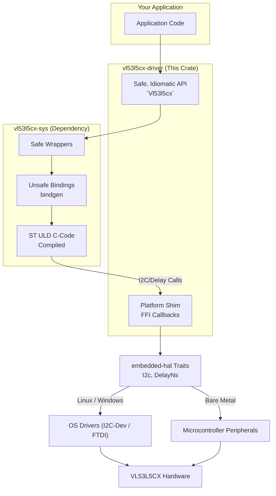

# VL53L5CX Driver (Rust)

[](https://crates.io/crates/wakefarm/vl53l5cx-driver)
[](https://docs.rs/vl53l5cx-driver)
[](LICENSE-MIT)
[](https://marketplace.visualstudio.com/items?itemName=bierner.markdown-mermaid)

A platform-agnostic Rust driver for the **STMicroelectronics VL53L5CX** Time-of-Flight (ToF) 8x8 multizone ranging sensor.

This crate acts as a high-level wrapper around the official ST Ultra Lite Driver (ULD), utilizing `embedded-hal` traits to allow usage on:
* **Microcontrollers:** STM32, ESP32, nRF52, RP2040, etc. (`no_std`)
* **Linux:** Raspberry Pi, Jetson Nano, etc. (`std`)
* **Windows / macOS:** Via USB-to-I2C adapters (FT232H, MCP2221) using crates like `ftdi-embedded-hal`.

## Features

- **Platform Agnostic**: Built on `embedded-hal` (I2C) traits.
- **FFI Wrapper**: Statically links the official ST VL53L5CX ULD C-driver.
- **Safe, Idiomatic API**: Provides a high-level, safe Rust interface over the C driver. All `unsafe` FFI calls are encapsulated within the `-sys` crate, ensuring the driver crate's public API is 100% safe.
- **`no_std` Compatible**: Designed for bare-metal and RTOS environments, with heap allocations (`alloc`) only used for optional features. The large firmware upload is handled without dynamic allocation in `no_std` mode.
- **Multi-Zone Ranging**: Access to 4x4 or 8x8 zones.
- **Modular**: Optional features (Motion, XtAlk, Thresholds) can be disabled to save flash memory.

## Installation

Add this to your `Cargo.toml`. You **must** select one target capacity feature.

```toml
[dependencies]
vl53l5cx-driver = { version = "0.1.0", features = ["xtalk", "motion", "targets-1"] }
```

### Feature Flags

To optimize RAM and binary size, this crate uses Cargo features to conditionally compile specific ULD plugins.

| Feature | Description | Enables Functions |
| :--- | :--- | :--- |
| **`xtalk`** | Crosstalk calibration support. Essential if using a cover glass. | `calibrate_xtalk`, `get_caldata_xtalk`, `set_caldata_xtalk` |
| **`motion`** | Motion indicator plugin. Detects movement per zone. | `motion_indicator_init`, `motion_indicator_set_distance_motion` |
| **`thresholds`**| Detection thresholds. Configures interrupt triggers. | `set_detection_thresholds` |

#### Target Capacity Configuration
Select **only one**. Higher target counts increase RAM usage.

| Feature | Description | Memory Impact |
| :--- | :--- | :--- |
| **`targets-1`** | **(Default)** Tracks the single strongest target. | Lowest RAM. |
| **`targets-2`** | Tracks up to 2 targets per zone. | Medium RAM. |
| **`targets-3`** | Tracks up to 3 targets per zone. | High RAM. |
| **`targets-4`** | Tracks up to 4 targets per zone. | Max RAM. |

## Usage

The following example demonstrates how to initialize the sensor and start ranging on a Linux system.

```rust
use vl53l5cx_driver::{Vl53l5cx, Resolution, RangingMode, TargetOrder, PowerMode, SharpenerPercent};
use embedded_hal::{i2c::{I2c, SevenBitAddress}, delay::DelayNs};

fn main() -> anyhow::Result<()> {
    // 1. Initialize platform-specific I2C and Delay peripherals.
    // This example uses `i2cdev` for Linux.
    let i2c_dev = i2cdev::linux::LinuxI2cDev::new("/dev/i2c-2", 0x29)?;
    let delay_dev = StdDelay; // A simple struct that implements `DelayNs`.

    // 2. Initialize the sensor driver.
    // This step uploads the ~90KB firmware to the sensor via I2C.
    println!("Initializing VL53L5CX...");
    let mut sensor = Vl53l5cx::new(i2c_dev, delay_dev, 0x29)?;
    println!("Sensor initialized.");

    // 3. Verify the sensor is alive and configure it.
    if !sensor.is_alive()? {
        anyhow::bail!("Sensor is not alive!");
    }

    sensor.set_resolution(Resolution::Res8x8)?;
    sensor.set_ranging_frequency_hz(15)?;
    sensor.set_ranging_mode(RangingMode::Autonomous)?;
    sensor.set_target_order(TargetOrder::Closest)?;

    // 4. Start ranging and read data.
    sensor.start_ranging()?;

    loop {
        // Poll for new data.
        if sensor.check_data_ready()? {
            let results = sensor.get_ranging_data()?;
            for (y, row) in results.distance_mm.chunks(8).enumerate() {
                for (x, dist) in row.iter().enumerate() {
                    // `dist` is the distance in millimeters.
                    print!("({:02}, {:02}): {:4}mm   ", x, y, dist);
                }
            }
        }
    }
    Ok(())
}
```

## API Reference

All functions return `Result<T, DriverError>`.

### Core Management & Configuration

| Function | Arguments | Return | Description |
| :--- | :--- | :--- | :--- |
| **`new`** | `i2c`, `delay`, `addr: u8` | `Vl53l5cx` | **Constructor.** Uploads firmware (~90KB) and boots sensor. |
| **`is_alive`** | None | `bool` | Returns `true` if sensor ID is `0xF0`. |
| **`set_i2c_address`** | `addr`: `u8` | `()` | Changes I2C address (resets on power cycle). |
| **`set_power_mode`** | `mode`: `PowerMode` | `()` | `Sleep` (low power) or `Wakeup`. |
| **`enable_internal_cp`** | None | `()` | Enables VCSEL charge pump (default). |
| **`disable_internal_cp`**| None | `()` | Disables charge pump (only if AVDD is 3.3V). |

### Ranging Parameters

| Function | Arguments | Return | Description |
| :--- | :--- | :--- | :--- |
| **`set_resolution`** | `res`: `Resolution` | `()` | `Res4x4` (60Hz max) or `Res8x8` (15Hz max). |
| **`set_ranging_frequency_hz`**| `hz`: `u8` | `()` | Sets frame rate. |
| **`set_ranging_mode`** | `mode`: `RangingMode` | `()` | `Continuous` or `Autonomous` (low power). |
| **`set_integration_time_ms`**| `ms`: `u32` | `()` | Manual exposure time (2-1000ms). |
| **`set_target_order`** | `order`: `TargetOrder`| `()` | `Closest` or `Strongest`. |
| **`set_sharpener_percent`** | `pct`: `SharpenerPercent` | `()` | Edge sharpening filter (0-99%). |
| **`set_vhv_repeat_count`** | `cnt`: `u32` | `()` | Temp calib interval. `0` disables auto-cal. |

### Ranging Control

| Function | Arguments | Return | Description |
| :--- | :--- | :--- | :--- |
| **`start_ranging`** | None | `()` | Locks settings and begins measurement. |
| **`stop_ranging`** | None | `()` | Ends measurement session. |
| **`check_data_ready`** | None | `bool` | Returns `true` if new data is ready. |
| **`get_ranging_data`** | None | `ResultsData` | Reads measurement block. |

---

## Architecture

This crate serves as a **Foreign Function Interface (FFI) wrapper** around the official STMicroelectronics Ultra Lite Driver (ULD).

Instead of rewriting the complex ranging algorithms from scratch, this crate embeds the vendor's C source code and exposes a safe, idiomatic Rust API.



### Key Concepts:

* **Platform Agnostic:** We implement the platform-specific C functions required by the ST ULD (`RdByte`, `WrByte`, `WaitMs`) by mapping them to the provided `embedded-hal` implementation in Rust.
* **Static Linking:** The crate utilizes a `build.rs` script to compile the original ST C-driver and link it statically to your final binary.

## Development Notes

### Viewing the Architecture Diagram
The architecture diagram in this README is created using Mermaid. To view it in Visual Studio Code's markdown preview, you will need to install the **Markdown Preview Mermaid Support** extension.


## ⚠️ License & Legal Disclaimer

### Rust Wrapper Code
The Rust source code in this crate is dual-licensed under either:

* **MIT License** ([LICENSE-MIT](LICENSE-MIT) or [http://opensource.org/licenses/MIT](http://opensource.org/licenses/MIT))
* **Apache License, Version 2.0** ([LICENSE-APACHE](LICENSE-APACHE) or [http://www.apache.org/licenses/LICENSE-2.0](http://www.apache.org/licenses/LICENSE-2.0))

at your option.

### STMicroelectronics Driver Code
This crate statically links and redistributes the **STMicroelectronics VL53L5CX Ultra Lite Driver**, which is located in the source tree.

**The STMicroelectronics ULD software is subject to the proprietary STMicroelectronics license terms (SLA0044).**

> **Important:** Usage of the underlying C driver is strictly limited to use with **STMicroelectronics products** (specifically the VL53L5CX sensor). By using this crate, you agree to the terms of the STMicroelectronics software license found in the `LICENSE-ST` file included in this repository.